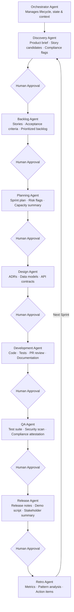

# ai-driven-product

> AI starts with product.

A reference implementation and workflow guide demonstrating how a federal software consulting firm can transform a traditional agile development process into an AI-native, agent-based workflow.

## The Shift

Every phase of the agile lifecycle gets an agent layer that handles toil, generates artifacts, and accelerates human decision-making. Humans stay in the loop at decision gates — agents do the drafting, structuring, and analysis.

## Agent-Based SDLC

Each phase of the agile lifecycle is supported by a dedicated agent. An orchestrator manages the full lifecycle, routing work and carrying context between phases. Humans approve artifacts at each gate before the next phase begins.

→ [Detailed phase breakdown](docs/sdlc-phases.md)

## Proprietary Agent Ownership

Sustainable competitive advantage comes from **building and owning the agents themselves**. Proprietary agents encode your firm's process knowledge, compliance expertise, and delivery patterns — and compound in value over time.

The system has two layers:
- **Orchestrator Agent** — manages the full lifecycle, routes work, carries context between phases
- **Phase Sub-Agents** — specialized agents per SDLC phase, each owning specific inputs and outputs

→ [Agent architecture](docs/agent-architecture.md) · [Build vs. buy rationale](docs/proprietary-agents.md)

## Federal Context

Federal engagements have non-negotiable requirements around compliance, data sovereignty, and auditability. These are built into the agent design from the start — not added at the end.

→ [Federal considerations](docs/federal-considerations.md)

## Key Principles

1. **Agents handle toil; humans handle judgment** — drafting, formatting, searching, and summarizing are agent tasks; decisions, approvals, and accountability stay human
2. **Every agent output is a starting point, not a final answer** — humans review and refine
3. **Artifacts flow between phases** — agents carry context forward (requirements inform tests, stories inform docs)
4. **Federal context is first-class** — compliance, security, and auditability are built into every phase, not bolted on at the end

## The Value Proposition

| Traditional Agile | Agent-Based Agile |
|---|---|
| Requirements written manually | Agents draft from source documents |
| Stories written in planning meetings | Agents generate from requirements |
| Tests written after code | Tests generated alongside code |
| Docs written at the end | Docs generated continuously |
| Reviews bottlenecked by bandwidth | Agent pre-review before human review |

## Tooling

- **AI:** Claude (Anthropic) — `claude-sonnet-4-6` for most tasks, `claude-opus-4-6` for complex reasoning
- **Interface:** Claude Code for agentic development workflows
- Stack, infrastructure, and integrations TBD as the project evolves
