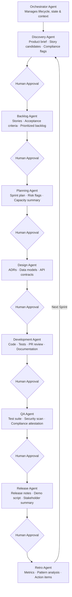

# Agent Architecture

This document describes the design of the proprietary agent system — the orchestrator that manages the full SDLC lifecycle and the sub-agents that handle each phase.

---

## Overview

The system is organized as a two-layer hierarchy: an orchestrator that manages the full lifecycle, and eight phase sub-agents that each own a specific stage of the SDLC. Artifacts flow between phases through the orchestrator, and humans approve work at each gate before the next phase begins.

The orchestrator manages workflow state and context passing. Sub-agents are specialized for their phase and operate independently when invoked.

---

## Orchestrator Agent

**Role:** Top-level agent that manages the full SDLC lifecycle. Routes work to phase agents, carries context between phases, tracks artifact state, and surfaces blockers for human review.

### Responsibilities
- Maintain project state across phases
- Pass relevant artifacts and context to each sub-agent
- Track human approval gates and block progress until cleared
- Surface risks, blockers, and anomalies to the team

### Design Considerations
<!-- Detail orchestrator prompt design, state management approach, how it determines which sub-agent to invoke, how it handles failures -->
TBD

---

## Sub-Agent Design Principles

Each sub-agent is designed around a consistent pattern:

1. **Receive** — accept structured inputs (artifacts, context, constraints)
2. **Process** — apply phase-specific logic and domain knowledge
3. **Output** — produce structured artifacts in a defined format
4. **Handoff** — pass outputs to the orchestrator for routing

### Prompt Engineering Approach
<!-- Detail how sub-agent system prompts are structured, what firm-specific knowledge is baked in, how prompts are versioned and improved -->
TBD

### Context Passing Between Phases
<!-- Detail how artifacts from one phase are formatted and passed to the next, what context is preserved, what is summarized -->
TBD

---

## Phase Sub-Agents

### Discovery Agent
- **Model:** `claude-opus-4-6` (high reasoning demand for complex document synthesis)
- **Primary inputs:** RFPs, interview notes, policy documents
- **Primary outputs:** Product brief, user story candidates, compliance flags
- **Design notes:** TBD

### Backlog Agent
- **Model:** `claude-sonnet-4-6`
- **Primary inputs:** Product brief, story candidates, compliance flags
- **Primary outputs:** Refined stories with acceptance criteria, prioritized backlog
- **Design notes:** TBD

### Planning Agent
- **Model:** `claude-sonnet-4-6`
- **Primary inputs:** Prioritized backlog, velocity data, team capacity
- **Primary outputs:** Draft sprint plan, risk flags
- **Design notes:** TBD

### Design Agent
- **Model:** `claude-sonnet-4-6`
- **Primary inputs:** Sprint stories, existing architecture docs, prior ADRs
- **Primary outputs:** ADRs, data models, API contracts
- **Design notes:** TBD

### Development Agent
- **Model:** `claude-sonnet-4-6`
- **Primary inputs:** Design artifacts, acceptance criteria, codebase context
- **Primary outputs:** Code, tests, documentation, PR review comments
- **Design notes:** TBD

### QA Agent
- **Model:** `claude-sonnet-4-6`
- **Primary inputs:** Implementation, acceptance criteria, compliance requirements
- **Primary outputs:** Test suite, security scan results, compliance attestation
- **Design notes:** TBD

### Release Agent
- **Model:** `claude-sonnet-4-6`
- **Primary inputs:** Merged PRs, commit history, sprint stories
- **Primary outputs:** Release notes, demo script, stakeholder summary
- **Design notes:** TBD

### Retro Agent
- **Model:** `claude-sonnet-4-6`
- **Primary inputs:** Sprint metrics, retro notes, prior action items
- **Primary outputs:** Metrics summary, pattern analysis, draft action items
- **Design notes:** TBD

---

## Human Approval Gates

The orchestrator enforces human review at key points before routing to the next phase. Gates are not bypassable.

| Gate | Blocks |
|---|---|
| Product vision approved | Backlog Agent start |
| Backlog approved | Planning Agent start |
| Sprint plan committed | Design Agent start |
| Architecture approved | Development Agent start |
| Code review approved | QA Agent start |
| QA sign-off | Release Agent start |
| Release approved | Deploy |

---

## Tooling & Infrastructure
<!-- Detail the technical implementation: API usage, agent framework (if any), state storage, logging, observability -->
TBD
